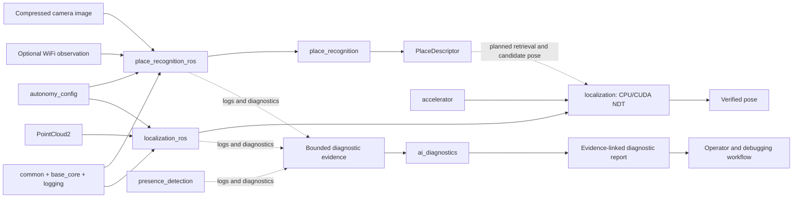

# Aegis Autonomy

Aegis Autonomy is a C++20 and ROS 2 Jazzy workspace for building bounded,
observable perception and localization software for mobile robots. The current
end-to-end direction is:

1. produce a learned place descriptor from a camera image and WiFi observation (optional);
2. retrieve likely places from a reference descriptor database;
3. verify a candidate geometrically with CUDA-accelerated LiDAR NDT; and
4. publish a pose correction only when the learned and geometric checks agree.

The repository is deliberately modular. Algorithms do not need ROS message
types, ROS adapters do not implement registration or neural-network math, and
CUDA launch details stay in CUDA translation units. This keeps the core code
testable and makes ownership, latency, capacity, and failure behavior visible.

This is a production-oriented research codebase, not a complete navigation
stack or a safety-certified product. The NDT and place-descriptor paths are
implemented independently; descriptor retrieval, static-map loading, NDT
candidate verification, and pose-correction integration are the next system
milestones.

## System direction

The learned model narrows the search space; it is not trusted to publish a
pose by itself. NDT supplies the geometric check. This division lets us improve
the neural model without weakening localization acceptance criteria, and lets
us benchmark registration independently of the model.

`ai_diagnostics` observes the stack from outside this decision path. Its goal
is to correlate bounded evidence from multiple autonomy modules, explain likely
fault chains, and give an operator a traceable starting point for debugging. It
does not modify results, restart nodes, or issue control commands.

## Engineering approach

- **Separate domain code from transport.** `localization` and
  `place_recognition` are reusable C++ libraries. Their `_ros` packages own
  subscriptions, message conversion, parameters, and publishers.
- **Bound work and memory.** Queues, point counts, voxel counts, iterations,
  line-search steps, diagnostic batches, and response sizes have configured
  limits. Overload becomes an observable failure instead of unbounded growth.
- **Make ownership explicit.** RAII owns threads, CUDA resources, shared-memory
  mappings, model state, and database connections. Shutdown rejects new work,
  drains or cancels according to each component's contract, and joins workers.
- **Avoid hidden message queues.** `waiting_subscriber_c` waits directly on an
  `rcl` wait set and takes a message only when the node is ready. Unread samples
  remain under DDS history control, and the node retains shared ownership only
  while processing a taken message.
- **Keep CUDA out of application code.** Typed buffers and generic execution
  patterns calculate launch geometry and indexing. Domain `.cu` files provide
  the device operation; normal C++ code owns the pipeline.
- **Use explicit completion boundaries.** CUDA work is ordered on a per-instance
  stream. Synchronization occurs at documented transfer or synchronization
  calls rather than after every operation.
- **Validate at system boundaries.** Generated TOML types, range checks, message
  shape checks, timestamps, frame names, tensor dimensions, and checkpoint
  dimensions are checked before use.
- **Do not silently change algorithms.** CUDA NDT reports accelerator failure;
  it does not silently run the CPU implementation. The CPU localizer remains an
  explicit numerical reference selected by the caller.
- **Keep diagnostics off critical paths.** Logging, persistence, and optional AI
  diagnostics use bounded queues and dedicated low-priority workers.

These rules do not make every path zero-copy. DDS, image decoding, LibTorch,
and host/device transfers each have their own ownership constraints. The code
avoids extra application buffering where it can and documents the remaining
copy boundaries so profiling can guide later optimization.

## Modules

### Foundation and runtime infrastructure

| Module | Responsibility | Why it improves production code |
| --- | --- | --- |
| [`common`](src/common) | Fixed-width numeric aliases, fixed-capacity strings, strict containers, bounded MPSC queues, time conversion, configuration validation, cancellable HTTP, and IPC codecs. | Gives every package the same bounded primitives and boundary checks instead of duplicating subtly different utilities. |
| [`autonomy_config`](src/autonomy_config) | Generates typed C++ configuration classes from `*.toml.default` schemas and loads runtime overrides from `AEGIS_AUTONOMY_CONFIG_DIR`. | Keeps the TOML schema and C++ representation synchronized. Nodes construct one validated configuration before allocating resources. |
| [`autonomy_msgs`](src/autonomy_msgs) | Bounded ROS interfaces for presence events, WiFi observations, place descriptors, and AI diagnostic reports. | Bounds variable-length fields at the interface definition and makes cross-package contracts reviewable. |
| [`base_core`](src/base_core) | Staged node lifecycle and runner, direct wait-set execution, waiting subscribers, bounded queues, thread helpers, named resource locks, Unix-domain IPC, and shared-memory ring buffers. | Centralizes shutdown, ownership, and concurrency behavior. Nodes spend less code on infrastructure and follow the same lifecycle. |
| [`logging`](src/logging) | Bounded process-local asynchronous logging with rotation, optional console/DDS sinks, queue-pressure statistics, and throttled logging. | Keeps file and DDS sink work off producer threads and exposes drops instead of blocking or allocating without limit. |
| [`database`](src/database) | Bounded asynchronous SQLite persistence with one worker-owned connection, prepared statements, batching, WAL coordination, and statistics. | Keeps SQLite calls out of caller threads and defines what happens on invalid input, contention, full queues, shutdown, and write failure. |
| [`utils`](src/utils) | Topic timing and DDS health monitoring for rate, delay, jitter, time regressions, deadline, liveliness, loss, and QoS faults. | Turns timing assumptions into measurable runtime health rather than relying only on node liveness. |

### Acceleration and localization

| Module | Responsibility | Why it improves production code |
| --- | --- | --- |
| [`accelerator`](src/accelerator) | Owns the CUDA device, stream, library handles, typed device buffers, tensor views, transfer boundaries, and type-erased operations. Provides `parallel_for`, `transform_reduce`, elementwise operations, and cuBLAS matrix multiplication. | Application developers work with tensor shape, type, and domain operations without writing thread-index or synchronization boilerplate. Buffers and reduction workspaces can be allocated once and reused. |
| [`localization`](src/localization) | Typed 3D NDT map plus bounded CPU and CUDA scan-to-map localizers. The CUDA path performs transform, neighbor lookup, correspondence filtering, and normal-equation reduction on the GPU. | The CPU implementation provides a numerical reference while the CUDA implementation accelerates the expensive per-point work. Eigen and CUDA types remain implementation details. |
| [`localization_ros`](src/localization_ros) | Converts `PointCloud2`, owns the waiting subscriber, loads localization configuration, and publishes `PoseStamped`. | Keeps bag playback and ROS graph wiring out of the registration library. The first-scan map mode provides a small integration smoke test before static-map support is added. |

The accelerator examples cover a vector pipeline, point-cloud centroid, and
image box blur. They demonstrate the same separation used by localization:
ordinary C++ owns buffers and operations, while a small `.cu` file defines the
device lambda. See the [accelerator guide](src/accelerator/README.md) and
[examples](src/accelerator/examples/README.md).

### Learned perception and place recognition

| Module | Responsibility | Why it improves production code |
| --- | --- | --- |
| [`place_recognition`](src/place_recognition) | A LibTorch model with separate camera and WiFi encoders, explicit availability masks, and a fusion head that emits a normalized descriptor. | One model supports camera-only, WiFi-only, or combined inference without making the runtime select among multiple inference engines. Missing modalities are explicit model inputs. |
| [`place_recognition_ros`](src/place_recognition_ros) | Waits for `CompressedImage`, optionally polls one timestamp-compatible `WifiObservation`, preprocesses the image, executes the model on CUDA when available, and publishes `PlaceDescriptor`. | Image-only rosbag playback cannot be blocked by a missing WiFi stream. DDS history depth controls pending data, and malformed or stale WiFi observations are rejected. |
| [`ml/place_recognition`](ml/place_recognition) | Offline C++/LibTorch training and evaluation using trajectory-ordered splits, triplet loss, modality dropout, retrieval metrics, HDF5 WiFi data, and an optional synchronized camera manifest. | Training and deployment share the same C++ model implementation, reducing preprocessing and architecture drift. Evaluation reports retrieval quality before integration into localization. |
| [`presence_detection`](src/presence_detection) | Camera acquisition plus a face/depth perception demonstrator using OpenCV, ONNX Runtime, a shared-memory camera path, and DDS fallback. | Exercises model deployment, camera ownership, bounded frame handoff, shared-memory IPC, and fallback behavior in a concrete perception pipeline. |
| [`ai_diagnostics`](src/ai_diagnostics) | Stack-wide advisory diagnostic reasoning over bounded ROS diagnostics or rotating logs, using an LLM-compatible local or edge model endpoint. | Keeps incident facts under node control and publishes model prose alongside the observed fault and source evidence ID, outside autonomy decision paths. |

The current place-model checkpoint is a **LibTorch parameter archive**, even
though it uses a `.pt` suffix. `place_recognition_ros` reconstructs the C++
module and loads its parameters with `torch::serialize::InputArchive`; it does
not currently load a Python-exported TorchScript module.

## AI-assisted autonomy diagnostics

[`ai_diagnostics`](src/ai_diagnostics) provides a diagnostic
and debugging layer for the whole autonomy system. Traditional health checks
are good at reporting individual symptoms: a LiDAR deadline was missed, an NDT
scan had too few correspondences, a CUDA call failed, a camera frame became
stale, or a queue started dropping records. The useful debugging question is
often how those symptoms relate over time and which subsystem should be
inspected first.

The implemented path is intentionally advisory and bounded:

1. ingest `diagnostic_msgs/DiagnosticArray` records or incrementally read the
   existing rotating node logs;
2. retain a bounded incident window and up to five preceding healthy records
   from the faulting node, with stable evidence identifiers and severity;
3. wait for sustained low CPU usage before requesting analysis;
4. send a size-limited request to a configured OpenAI-compatible local SLM or
   edge endpoint;
5. reject malformed or oversized chat responses; and
6. publish a bounded `autonomy_msgs/msg/AiDiagnosticReport` with the observed
   fault, its source evidence ID, and the model's unverified prose analysis.

The incident window is built from node observations, so model prose cannot
become evidence in a later diagnosis. An observed active fault
can be reported while its cause is unresolved; recovery requires a later
healthy status from the same source. The local-model benchmark uses one
synthetic LiDAR log to compare ambiguous drift, timing evidence, geometric
evidence, and a recovered warning without revealing future records to an
earlier request.
The model is asked to compare measurements against the healthy baseline and
state when the evidence cannot distinguish causes. The complete HTTP response
is bounded by `maximum_response_bytes` (64 KiB by default); an overlong
response is rejected.
The log-file input now extracts bounded numeric `name=value` metrics into the
same measurement fields used by DDS input, so both paths give the model
comparable baseline and incident values.
The node derives incident identity and source from observations. It does not
use a model-generated confidence score or cause code.

The default backend is a separately launched local model server; no paid API
is required. Its chat-completions interface also lets deployments use a trusted
edge endpoint without changing autonomy nodes. The
[AI diagnostics guide](src/ai_diagnostics/README.md) gives a local CUDA server
example and its resource limits. Its local-model smoke test reports bounded
response details when a case fails and continues through the remaining cases.

The safety boundary is as important as the model. The package is disabled by
default, never executes model prose, and does not start, stop, restart,
or reconfigure another node. Uncertain model prose does not hide an observed
active fault; recovered windows do not publish an active warning. The model
server must have its own CPU/GPU limits, and operators remain
responsible for accepting any recovery action.

Before this becomes a dependable operational tool, the project still needs:

- standardized structured health events from localization, acceleration,
  perception, timing monitors, logging, and persistence;
- broader replayable fault-injection scenarios with expected root causes;
- measurements for unsupported claims, false positives, missed correlations,
  latency, and model resource interference;
- clear endpoint privacy and data-retention rules; and
- an operator view that links every report back to its source records and
  relevant runtime metrics.

## Current state

Implemented in the repository:

- the ROS 2 lifecycle, wait-set, bounded queue, shared-memory, configuration,
  logging, database, and monitoring foundations;
- reusable CUDA execution patterns with vector, point-cloud, and image examples;
- bounded CPU and CUDA NDT registration cores;
- a ROS adapter that consumes LiDAR bags and runs the initial first-scan-map
  integration path;
- camera/WiFi place-encoder training and evaluation in C++ LibTorch;
- camera-driven ROS inference with optional WiFi;
- a CUDA LibTorch smoke test that executes the encoder on the visible NVIDIA
  GPU; and
- AI diagnostic ingestion from DDS or rotating logs, bounded endpoint
  requests, incident-window retry, and advisory reports.

Still being developed:

- repeatable dataset preparation and published NDT/place-recognition benchmark
  results;
- persistent checkpoint metadata, WiFi normalization statistics, and model
  compatibility checks;
- a static NDT map loader and map lifecycle;
- a reference descriptor database and nearest-neighbor retrieval;
- learned candidate to NDT verification and pose-correction integration;
- TensorRT export/runtime after the LibTorch model establishes an accuracy
  baseline;
- standardized health evidence and a fault corpus for evaluating
  `ai_diagnostics`; and
- end-to-end latency, GPU-memory, throughput, and failure-injection profiles.

## Documentation

Use the guides according to the task:

- [Installation and build](INSTALL.md) covers Distrobox, ROS 2, CUDA, LibTorch,
  Conan, workspace builds, tests, shell setup, and runtime configuration.
- [Accelerator](src/accelerator/README.md) explains buffer ownership, execution
  patterns, synchronization boundaries, and adding domain CUDA operations.
- [Accelerator examples](src/accelerator/examples/README.md) shows complete
  vector, point-cloud, and image pipelines.
- [Localization core](src/localization/README.md) documents the CPU and CUDA NDT
  APIs and benchmark scope.
- [Localization ROS adapter](src/localization_ros/README.md) explains LiDAR bag
  playback, topics, configuration, and first-scan-map limitations.
- [Place-recognition experiment](ml/place_recognition/README.md) covers dataset
  layout, training, evaluation, and retrieval metrics.
- [Place-recognition ROS adapter](src/place_recognition_ros/README.md) explains
  checkpoint loading, image-only playback, optional WiFi, and descriptor output.
- [AI diagnostics](src/ai_diagnostics/README.md), [logging](src/logging/README.md),
  and [database](src/database/README.md) document their runtime contracts.

The existing
[Aegis Autonomy tmuxp session](tools/tmuxp/launch_aegis_autonomy.yaml) currently
starts the camera publisher, perception node, and image viewer for the
presence-detection demonstrator.

## Runtime configuration model

Files under [`src/autonomy_config/config`](src/autonomy_config/config) define
the schemas and compile-time defaults. The build generates typed C++ classes
from these TOML files. Deployment overrides are loaded from the directory named
by `AEGIS_AUTONOMY_CONFIG_DIR`; generated headers are never edited manually.

Domain limits and model dimensions live in TOML. ROS parameters are reserved
for graph wiring such as topic names and `use_sim_time`. This prevents a
launch command from silently changing the numerical behavior of an algorithm.
The exact copy-and-override procedure is in
[INSTALL.md](INSTALL.md#9-runtime-configuration).

## Evolution plan

The repository is growing from independently testable components toward one
measurable localization pipeline:

1. **Foundation:** bounded containers, deterministic lifecycle, configuration,
   logging, persistence, wait sets, and timing diagnostics.
2. **Compute abstraction:** reusable CUDA ownership and execution patterns so
   domain packages contain only domain operations.
3. **Geometric localization:** CPU-reference and CUDA NDT with bounded solver
   behavior and ROS bag ingestion.
4. **Learned retrieval:** camera and optional WiFi descriptors trained and
   deployed through the same C++ model.
5. **Cross-stack diagnostics:** structured health evidence, bounded
   multi-module correlation, replayable fault cases, and an evidence-linked
   operator debugging workflow.
6. **System integration:** reference descriptor indexing, candidate retrieval,
   static-map selection, NDT verification, and accepted pose correction.
7. **Deployment optimization:** profiling-driven buffer reuse, asynchronous
   transfers where ownership permits, TensorRT inference, and recorded latency
   and memory budgets.

Each step must keep a usable boundary and a benchmark. New abstractions are
added when a domain algorithm needs them, and optimizations are retained only
when profiles show a measurable benefit.
